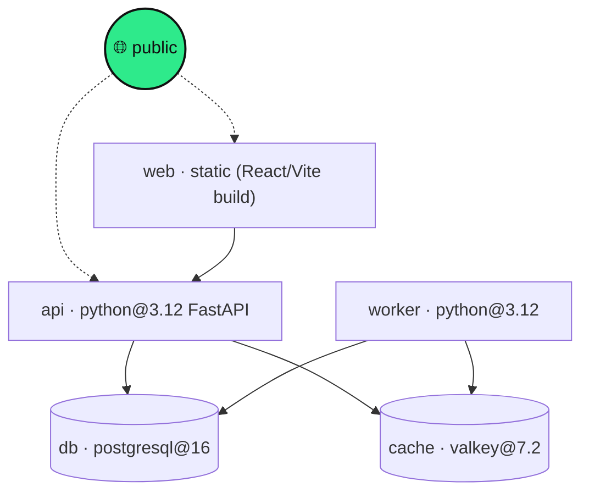

# ShipMate — Architecture

This document is the "explain your architecture to the judges" companion to the
code. It covers what each piece does, why it's shaped that way, and how the
whole thing runs on Zerops.

---

## 1. The one idea

**Three very different inputs, one output path.**

Whether you paste a `docker-compose.yml`, drop a GitHub URL, or describe an app
in plain English, everything is normalised into a single intermediate
representation — a `Topology` — and *every* consumer (YAML generator, linter,
diagram) reads that one structure. This is the design decision that keeps the
codebase small and the behaviour consistent across modes.

```
                 ┌─────────────────────┐
  compose ─────► │                     │
  repo url ────► │   Topology (IR)     │ ──► zerops.yaml generator
  prompt ──────► │  services + edges   │ ──► project-import generator
                 │                     │ ──► misconfig linter
                 └─────────────────────┘ ──► architecture diagram (graph)
```

The IR lives in [`api/app/core/schema.py`](api/app/core/schema.py): a `Topology`
is a list of `Service`s, each tagged with a **role** (`frontend`, `api`,
`worker`, `database`, `cache`, `storage`, `broker`, `search`) plus the fields a
Zerops config needs (base, ports, start, env, HA mode, dependencies).

## 2. The three input modes

| Mode | Module | LLM? | Notes |
|------|--------|------|-------|
| **compose** | `core/compose_parser.py` | no | Deterministic. Maps Compose services → Zerops services, images → managed types, `depends_on` → private-network edges. `build:` services are cross-referenced against their own Dockerfile. |
| **repo** | `core/repo_fetcher.py` → `core/detector.py` | no | Fetches a public repo's tree + manifests via the GitHub API (no clone), then detects the stack. Handles Dockerfiles (multi-stage aware), monorepos (one service per top-level dir), and dependency scans. |
| **prompt** | `core/llm.py` | yes | Azure OpenAI turns English into a *structured service list only*; the deterministic generator still writes the YAML. The risky free-form step is contained; the trustworthy step stays in our code. |

**Why compose-first:** it's the most reliable path (zero LLM), so it's the
foundation the other two lean on. The repo detector even hands off to the
compose parser when it finds a `docker-compose.yml` in the repo.

### Optional AI gap-filling (repo / compose modes)
When Azure is configured and the user ticks **"✨ use AI to fill gaps"**, a
second pass runs *after* deterministic detection: `llm.enhance_topology()`
sends the detected topology + a repo summary to the model and gets back a
strict JSON of `fill` (missing start/port/base on existing services) and `add`
(a datastore or worker the static analysis missed). `llm.apply_enhancement()`
merges it **conservatively** — it only fills *empty* fields and only adds
*new* hostnames, never overwriting a good detection — and every change is
recorded as a note. This keeps the trustworthy deterministic result intact
while letting the LLM close gaps it can genuinely see in the code. The merge is
pure and unit-tested; the network call is best-effort and never fails the
request.

### Detection heuristics (repo mode)
Priority order, most authoritative first:
1. Root `docker-compose.yml` / `compose.yml` → compose parser owns it.
2. Monorepo: runtime markers in ≥2 top-level dirs → one service per dir
   (`backend`→`api`, `frontend`→`web` aliases), frontends wired to APIs.
3. `Dockerfile`: `FROM` → base (multi-stage alias resolution + registry-keyword
   fallback for `mcr`/`ghcr` images), `EXPOSE` → port, `CMD`/`ENTRYPOINT` →
   start, `ENV` → env vars.
4. Language marker (`package.json`, `requirements.txt`, `go.mod`, …).
5. Dependency scan: Postgres/Redis/S3 client libraries → managed services.

### Monorepo build contexts (learned from a real deploy failure)

Zerops build commands run in `/build/source` — the repo root as pushed. A
monorepo service whose code lives in `api/` therefore cannot run a bare
`pip install -r requirements.txt`. Each `Service` carries a `src_dir`, and the
generator uses it everywhere:

- build commands run inside the dir via a single literal shell block
  (`cd api` + the steps — emitted as a YAML `|` block, since quoted style
  would fold the newlines and break the shell)
- `deployFiles: api/~` ships the *contents* of the dir (Zerops' `~` shorten
  syntax), so `run.start` executes against the expected layout
- frontends deploy `<dir>/dist/~`; node caches point at `<dir>/node_modules`

### The Python dependency pattern (build ≠ runtime)

Zerops builds and runs in **separate containers**. A `pip install` in
`build.buildCommands` installs into the build container's site-packages, which
`deployFiles` never ships — the app then crashes at runtime with
`ModuleNotFoundError`. The official pattern (which ShipMate emits, and uses for
its own services) is:

```yaml
build:
  deployFiles: ./            # or <dir>/~ in a monorepo
  addToRunPrepare:
    - requirements.txt       # carried to the runtime-prepare container
run:
  prepareCommands:
    - python3 -m pip install --ignore-installed -r requirements.txt
```

## 3. The generator

[`core/zerops_generator.py`](api/app/core/zerops_generator.py) emits three
artifacts from a `Topology`:

- **`zerops.yaml`** — one `setup:` block per *runtime* service, each with
  `build` (base, buildCommands, deployFiles, cache) and `run` (base, ports,
  start, envVariables).
- **`zerops-project-import.yml`** — declares *every* service (runtimes +
  managed types with HA mode, public services with `enableSubdomainAccess`).
- **graph** — nodes + edges for the frontend diagram, including a synthetic
  `__public__` node feeding every public service.

The `zerops.yaml` schema was verified against the Zerops docs; the mappings live
in [`core/mappings.py`](api/app/core/mappings.py) and are hand-curated because
config accuracy is the whole product.

## 4. The linter

[`core/linter.py`](api/app/core/linter.py) is the "aha" feature — the mistakes
that make a first Zerops deploy fail, each with a one-line fix. Rules are
plain functions registered with a decorator, so adding one is a few lines.
Current rule set: missing `run.start`, missing/blank ports on a public service,
`httpSupport` missing on a public port, `localhost` references (should be
private hostnames), a DB referenced but not declared, public service without
subdomain access, hard-coded secrets, **self-referencing env vars**
(`VAR: ${VAR}` — the bug that broke a live deploy), unresolved `${...}`
interpolation, `deployFiles` shipping too much, and NON_HA production databases.

## 5. How ShipMate runs on Zerops

ShipMate deploys as **five services over the private network** — which is both
the product's dogfood and the answer to the challenge's "meaningful Zerops use"
criterion.



- **web** — built to static assets, `enableSubdomainAccess`.
- **api** — the generator/linter/LLM orchestration ([`app/main.py`](api/app/main.py)).
- **worker** — clones repos and runs longer LLM calls off the request path.
- **db** — generation history / saved configs ([`app/store.py`](api/app/store.py),
  Postgres with an in-memory fallback so it runs locally with zero deps).
- **cache** — Valkey for hot-result caching, rate-limiting, and the worker job queue.

Service configs: [`web/zerops.yaml`](web/zerops.yaml),
[`api/zerops.yaml`](api/zerops.yaml), [`worker/zerops.yaml`](worker/zerops.yaml).
Project topology: [`zerops-project-import.yml`](zerops-project-import.yml).

## 6. Local vs Zerops

Nothing is hard-wired to Zerops. Every connection detail (DB host, cache host,
Azure keys) is read from environment variables, so "local" and "Zerops" differ
only in env values. `docker-compose.yml` provides local Postgres + Valkey; the
app degrades gracefully (in-memory store, prompt mode disabled) when they and
the Azure keys are absent.

## 7. Tests

[`api/tests/`](api/tests) — 44 tests, all offline (`make test`): the compose
parser, the detector (Dockerfile parsing, monorepo handling, build contexts,
infra-only compose merging), the linter + score, the offline prompt parser, the
AI-enhancement merge (including its never-overwrite guard), persistence
round-trips, and the deploy-wizard script builder. Several are regression tests
from real deploy failures — see the commit history for the war stories.
