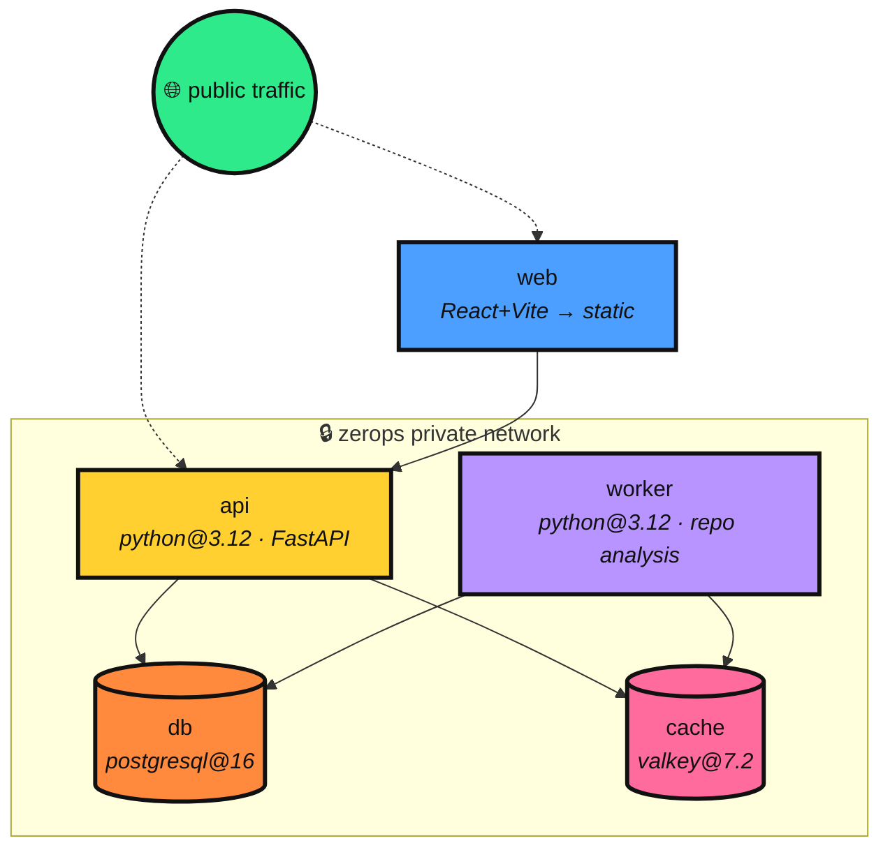
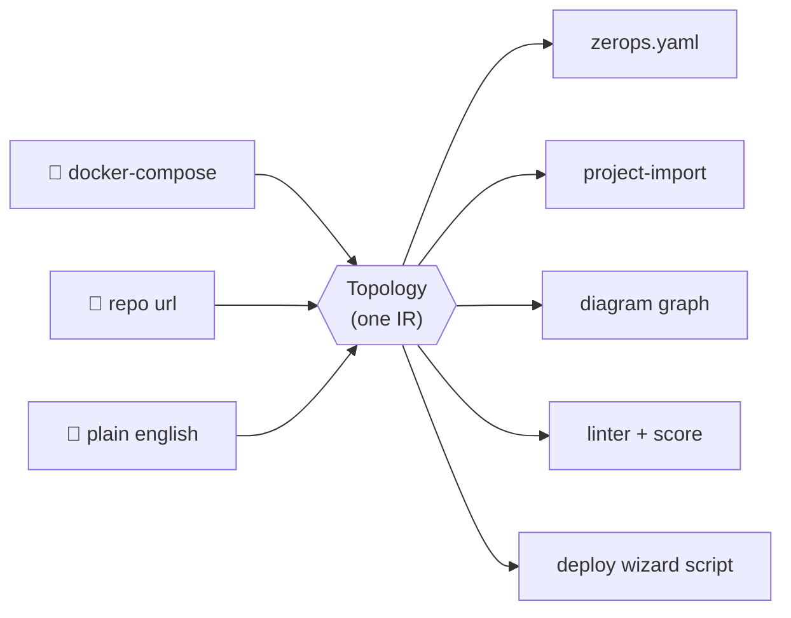

<p align="center">
  
</p>

<p align="center"><b>Describe an app → get a validated <code>zerops.yaml</code>, an interactive architecture map, and your exact deploy script.</b></p>

<p align="center">
  
  
  
  
  
</p>

<p align="center">
  
</p>

---


A zerops.yaml copilot and architecture visualizer, built for
**The Zerops Challenge** (Aug 8–9, 2026). Give it a `docker-compose.yml`, a
public GitHub repo, or a plain-English description, and it:

1. **Generates** a schema-correct `zerops.yaml` + project-import file
   (service types verified against the Zerops docs — no hallucinated versions)
2. **Visualizes** the topology on an interactive canvas — drag nodes, pan,
   zoom, fullscreen
3. **Lints** the config for the mistakes that break first deploys, with a
   0–10 **deploy-readiness score**
4. **Deploys** via a wizard: answer 3 questions, get a deterministic `zcli`
   script for *your* situation
5. **Shares** results as permanent links (persisted to Postgres)

**The proof:** point ShipMate at its own repo and it reproduces its exact
five-service architecture — the same config it's deployed with on Zerops.
*It runs on the output of itself.*

## Architecture

ShipMate deploys as five services over Zerops' private network:



Everything funnels through one intermediate representation (a `Topology`):
three very different inputs, one trustworthy output path.



## Docs

| Doc | What's inside |
|---|---|
| 📘 [**FEATURES.md**](FEATURES.md) | The complete product reference — every mode, rule, button, endpoint, fallback and limit |
| 🏗️ [**ARCHITECTURE.md**](ARCHITECTURE.md) | The design in depth — the one-IR idea, detection heuristics, monorepo handling, the build-vs-runtime dependency pattern |
| 🚀 [**DEPLOY.md**](DEPLOY.md) | Step-by-step Zerops deployment with `zcli`, including the subdomain-before-deploy 502 gotcha |
| 🔧 [**TROUBLESHOOTING.md**](TROUBLESHOOTING.md) | 10 real deploy errors we hit and fixed — and why **ZCP is a debugging tool, not just a builder** |
| 🤖 [**AI_DISCLOSURE.md**](AI_DISCLOSURE.md) | AI-usage disclosure (challenge rules) |

## Features

| Feature | Detail |
|---|---|
| **3 input modes** | compose (deterministic), repo URL (GitHub API fetch — no clone), prompt (LLM with a zero-config offline fallback) |
| **Monorepo-aware** | one service per top-level dir (`backend/`→api, `frontend/`→web), build commands `cd` into each dir, `deployFiles: <dir>/~` |
| **Dockerfile parser** | multi-stage alias resolution, `FROM/EXPOSE/CMD/ENV`, registry-keyword fallback (mcr/ghcr) |
| **Verified service types** | `valkey@7.2`, `mariadb@10.4`, `nats@2.10`… checked against the Zerops docs; unsupported images (Mongo, RabbitMQ) get substitutes + explicit warnings |
| **Production-correct output** | frontends build to `static` (never `npm run dev`), python deps install via `addToRunPrepare` + `run.prepareCommands` (the official pattern), workers get real background commands + no ports |
| **Misconfig linter** | 9 rules, each with a one-line fix, rolled into a 0–10 score |
| **AI gap-fill (optional)** | LLM refines a detected topology — fills *empty* fields and adds missing services only; never overwrites a good detection |
| **Deploy wizard** | project name, new-vs-existing project, service selection, DB HA mode → deterministic `zcli` script |
| **Shareable links** | `/?g=<id>` re-opens any generation (Postgres-backed) |

## Run it locally

```bash
# fastest smoke test — no server needed
cd api && pip install -r requirements.txt
python shipmate_cli.py compose ../examples/taskboard-compose.yml
python -m pytest tests/ -q          # 44 tests

# full app
make infra    # local postgres + valkey via docker compose (optional — in-memory fallback)
make api      # FastAPI  → http://localhost:8000
make web      # Vite     → http://localhost:3000
```

Prompt-mode LLM + AI gap-fill activate when `AZURE_OPENAI_*` vars are set
(see `.env.example`); without them the offline parsers take over — every
feature still works.

## Deploy to Zerops

```bash
zcli login <token>
zcli project project-import zerops-project-import.yml
cd api && zcli push api && cd ..
cd worker && zcli push worker && cd ..
# set VITE_API_BASE on web (GUI, build-time) to the api's public URL, then:
cd web && zcli push web && cd ..
```

Full walkthrough with secrets setup and troubleshooting: [`DEPLOY.md`](DEPLOY.md).

## Repo layout

```
shipmate/
├── zerops-project-import.yml   # ShipMate's own 5-service Zerops topology
├── docker-compose.yml          # LOCAL dev: postgres + valkey
├── api/                        # FastAPI — the brain
│   ├── app/core/
│   │   ├── schema.py               # the Topology intermediate representation
│   │   ├── compose_parser.py       # mode: docker-compose → Topology
│   │   ├── repo_fetcher.py         # GitHub API fetch (tree + manifests, no clone)
│   │   ├── detector.py             # mode: repo → Topology (Dockerfiles, monorepos)
│   │   ├── prompt_heuristic.py     # mode: english → Topology (offline, zero-config)
│   │   ├── llm.py                  # Azure OpenAI: prompt mode + AI gap-fill
│   │   ├── zerops_generator.py     # Topology → zerops.yaml + import + graph
│   │   ├── linter.py               # misconfig rules + 0–10 score
│   │   ├── deploy_script.py        # the wizard's deterministic script builder
│   │   └── mappings.py             # verified image/runtime → Zerops type table
│   ├── shipmate_cli.py         # use the core with no server
│   ├── tests/                  # 44 tests, all offline
│   └── zerops.yaml
├── worker/                     # background repo analysis
└── web/                        # React + Vite, neo-brutalist UI
    └── src/components/         # Diagram.jsx (interactive canvas), DeployWizard.jsx
```

## Testing

**44 tests, all offline, run in ~0.1s** (`cd api && python -m pytest tests/ -q`).
The whole generation core is covered — no live API or network needed to run
the suite:

| Suite | Covers |
|---|---|
| `test_compose.py` | compose → topology, verified managed types, unsupported-image substitution, infra-only merge, **env-interpolation stripping** |
| `test_detector.py` | Dockerfile parsing (multi-stage), monorepo detection, **monorepo build contexts**, single-repo python pattern, static-frontend output |
| `test_prompt.py` | offline intent parser, AI-enhancement **never-overwrite** guard, persistence round-trip |
| `test_linter.py` | misconfig rules incl. the **self-referencing-env** rule, score grades |
| `test_deploy_script.py` | the deploy wizard's deterministic script builder |

Many are **regression tests distilled from real deploy failures** — every bug
we hit on Zerops became a locked-in test (see below).

## Battle-tested, literally

We deploy-tested the generator against real Zerops and it failed **repeatedly**:
hallucinated service versions, dev servers in prod, workers cloning the API's
start command, dropped secrets, wrong build contexts in monorepos, pip installs
that never reach the runtime container, and a self-referencing env var that
broke a live deploy. Every failure became a fix **plus a regression test** —
which is how the suite grew to 44. The full story is in the commit history and
[`TROUBLESHOOTING.md`](TROUBLESHOOTING.md).

## Tech

React + Vite · Python / FastAPI · Azure AI Foundry (GPT) · PostgreSQL 16 ·
Valkey 7.2 · deployed on Zerops.

## AI-usage note (challenge rules)

See [`AI_DISCLOSURE.md`](AI_DISCLOSURE.md) — one AI tool (Hyperagent) was used,
under my direction; Azure OpenAI is a runtime product feature. The architecture
and every decision are documented and explainable.
